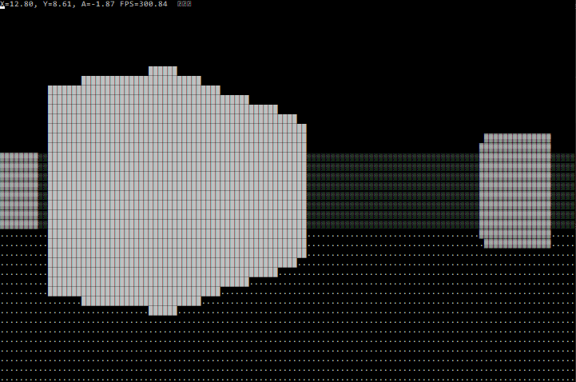

## Простая игрушка с использовнием технологии Ray casting

### Технологический стек
* Win API для управления
* Двойная буферизация для исключения мерцаний в консоли

### Описание
В "игре" можно ходить по карте и крутить камерой на 360°, предусмотрена коллизия. 
Дальние объекты прорисованы более тёмными символами, ближние - светлыми.

Программа создана для ознакомления меня с методом рендеринга ray casting, так называемой, псевдо-3D графикой, ставшей прорывом в 90-х.

### Управление
* W - вперёд
* S - назад
* A - поворот влево
* D - поворот вправо

